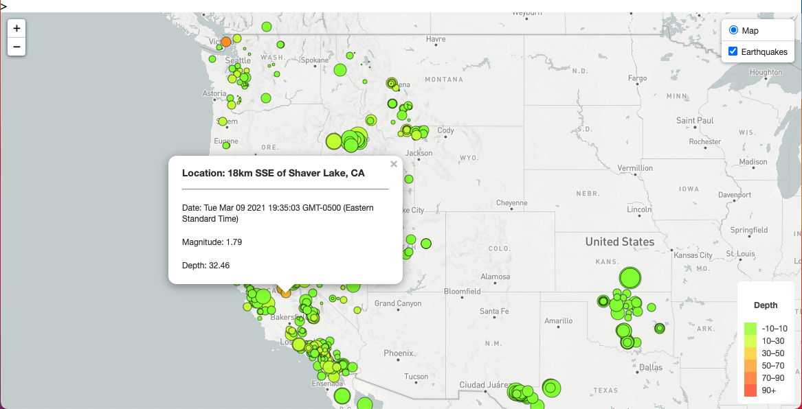
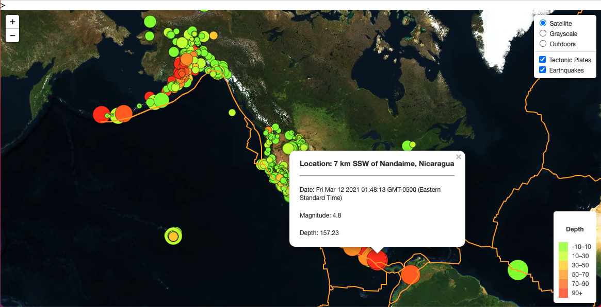

# leaflet-challenge

For this homework, all earthquakes data from the past 7 Days were pulled from [USGS (United States Geological Survey)](https://earthquake.usgs.gov/earthquakes/feed/v1.0/geojson.php) in the GeoJSON format to create layers of maps by using Leaflet, a javascript library for interactive maps. In addition, tectonic plates boundaries data were pulled from a github repo [World tectonic plates and boundaries](https://github.com/fraxen/tectonicplates), for visualizing the relationship between tectonic plates and seismic activity.

* Remember to pass in your unique Mapbox token.
### USGS Earthquake Data Visualization Level 1

### USGS Earthquake Data Visualization Level 2

Main languages and libraries used in this homework:
* Javascript
* Leaflet
* D3
* CSS
